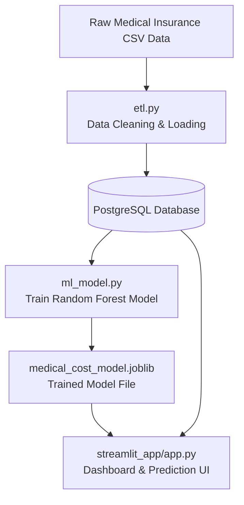

# Health Claims ETL Pipeline

A comprehensive end-to-end ETL and machine learning pipeline that processes medical insurance claims data, predicts annual medical costs, and visualizes insights through an interactive Streamlit dashboard.

---

## About the Project

This project demonstrates a full **end-to-end data engineering and analytics pipeline** using Python and PostgreSQL. It ingests raw medical insurance data, cleans and transforms it, loads it into a Postgres data warehouse, trains a Random Forest regression model to predict annual medical costs, and streams interactive analytics and cost predictions via a Streamlit dashboard.

The goal is to showcase scalable ETL, machine learning integration, and business intelligence visualization, suitable for healthcare insurance analytics, risk scoring, and cost management.

---

## Tools & Technologies Used

- **PostgreSQL** (via Docker) for relational data warehousing  
- **Python** (pandas, SQLAlchemy, scikit-learn, joblib) for ETL and ML workflows  
- **SQL** for schema design and analytical queries  
- **Machine Learning**: Random Forest regression trained on insurance data  
- **Streamlit**: Dashboard for interactive visualization and prediction  

---

## Concepts Demonstrated

- **Data Warehousing**: Star schema with dimension and fact tables  
- **ETL Pipeline**: Data extraction, cleaning, transformation, and loading into Postgres  
- **Machine Learning**: Random Forest regression for predicting medical costs  
- **Data Analysis**: Queries answering business questions  

---

## Architecture Diagram

## How to Use the Streamlit Dashboard?

The Streamlit app provides an **interactive analytics and prediction interface** that queries the PostgreSQL database and uses the trained ML model to generate predictions on demand.

Displayed charts and features include:

- Patient Demographics: Age, Sex, Region

- Insurance Details: Plan Type, Deductible, Copay

- Medical Claims: Annual Medical Cost, Claims Count

- Predictions: Estimated Annual Medical Cost based on user inputs

The dashboard supports filters by region and age group to enable drill-down analysis into claims patterns and cost drivers.

Here’s the Streamlit demo: https://health-claims-calistajajalla.streamlit.app/

## Next Steps / Recommendations

- Incorporate additional data sources like hospital visits or pharmacy claims

- Deploy the pipeline and dashboard on cloud platforms (AWS, Azure) for scalability

- Expand ML models to include risk classification or cost anomaly detection

- Improve dashboard UI with export functionality and alerts for high-risk patients

