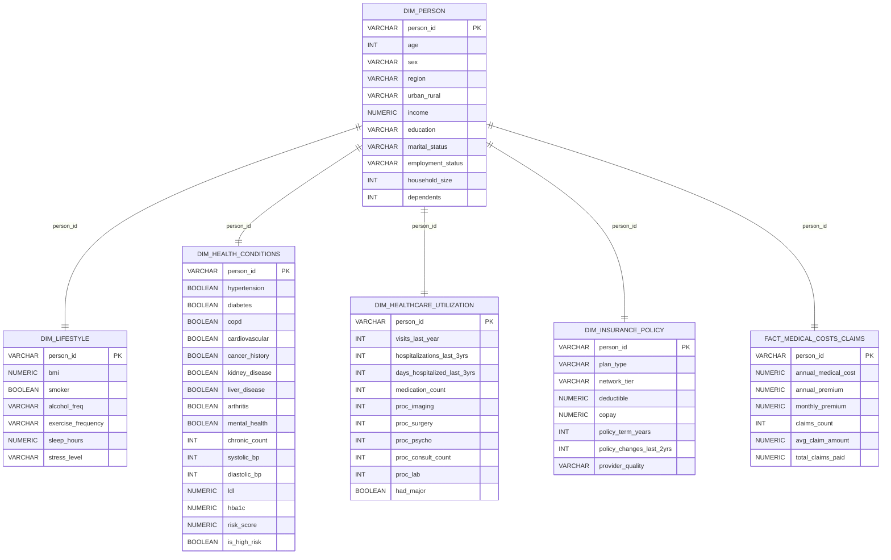

# 📁 Health Claims ETL Project Setup by Calista Jajalla ᓚᘏᗢ

## Table of Contents

1. [Project Folder Structure](#1-project-folder-structure)  
2. [About the Dataset](#2-about-the-dataset)  
3. [Setup Python Virtual Environment (venv)](#3-setup-python-virtual-environment-venv)  
4. [Docker Setup (Postgres Database)](#4-docker-setup-postgres-database)  
5. [Create Database Tables (Schema Setup)](#5-create-database-tables-schema-setup)  
6. [Running the ETL Pipeline](#6-running-the-etl-pipeline)  
7. [Training the Machine Learning Model](#7-training-the-machine-learning-model)  
8. [Launching the Streamlit Dashboard](#8-launching-the-streamlit-dashboard)  

---

## 1. Project Folder Structure

Make sure your project directory looks like this:

```bash
health-claims-etl/
├── README.md  
├── docker-compose.yml  
├── data/  
│   └── medical_insurance.csv  
├── etl/  
│   ├── etl.py                     # main ETL script that uses db.py for DB connection  
│   ├── ml_model.py                # ML training script  
│   ├── db.py                      # Postgres connection engine  
│   ├── medical_cost_model.joblib  # saved ML model (large, usually not in repo)  
│   └── scaler.joblib              # saved scaler used in ML pipeline  
├── sql/  
│   └── create_tables.sql          # SQL schema to create warehouse & staging tables  
├── streamlit_app/  
│   ├── app.py                    # Streamlit dashboard starter, loads model and connects to DB  
│   └── Dockerfile                 # Dockerfile for containerizing the Streamlit app  
├── requirements.txt               # Python dependencies  
└── venv/                         # Python virtual environment (.gitignored)
```

---

## 2. About the Dataset

Medical Insurance Cost Prediction Dataset (Kaggle)

This dataset has 100,000 rows and 54 columns describing individuals’ demographics, health, lifestyle, insurance, and medical costs.

Link: https://www.kaggle.com/datasets/mohankrishnathalla/medical-insurance-cost-prediction

Key feature groups:

- Demographics (age, sex, income, region)  
- Lifestyle (bmi, smoker, alcohol frequency)  
- Health conditions (hypertension, diabetes, COPD, cardiovascular)  
- Healthcare utilization (hospital visits, procedures)  
- Insurance details (plan type, deductible, copay)  
- Costs (annual medical cost, premiums, claims)

No missing values but requires light cleaning of booleans and categorical fields.

Useful for ETL pipelines, cost prediction, risk scoring, and claims analytics.

---

## 3. Setup Python Virtual Environment (venv)

Create and activate an isolated Python environment, then install dependencies:

```bash
python3 -m venv venv  
source venv/bin/activate            # Linux/Mac  
# .\venv\Scripts\activate          # Windows  

pip install --upgrade pip  
pip install -r requirements.txt  
```

---

## 4. Docker Setup (Postgres Database)

Create docker-compose.yml file (see at file section). Then, start the Postgres database and any other services via Docker Compose:

```bash
docker-compose up --build -d  
```

This runs your Postgres container (`hc_postgres`) needed for data storage.

---

## 5. Create Database Tables (Schema Setup)

Before running ETL, create the necessary tables (see `create_tables.sql` under the sql folder) in the Postgres database. Here's a diagram illustrating the fact and dimension tables.


---

Then, run this in terminal to create the tables:

```bash
cat sql/create_tables.sql | docker exec -i hc_postgres psql -U user -d health_claims  
```

This sets up all staging and warehouse tables referenced by your ETL scripts.

---

## 6. Running the ETL Pipeline
See `etl.py` (under the etl folder) which processes the raw CSV data, performs cleaning and transformation, and loads the cleaned data into Postgres tables. The script uses `db.py` to establish the database connection and execute SQL commands.

Key parts of the ETL process with relevant snippets:

1. **Load raw CSV and perform data quality check (check for missing critical column 'person_id')**

```python
import pandas as pd

DATA_PATH = "data/medical_insurance.csv"
df = pd.read_csv(DATA_PATH)

def data_quality_check(df):
    if 'person_id' not in df.columns:
        raise KeyError("Critical column 'person_id' is missing!")
    df = df.dropna(subset=['person_id'])
    return df

df = data_quality_check(df)
```

2. **Clean and transform data (fill missing values and normalize columns)**

```python
def clean_transform(df):
    # Fill numeric missing with median
    numeric_cols = df.select_dtypes(include='number').columns
    for col in numeric_cols:
        df[col] = df[col].fillna(df[col].median())

    # Normalize 'smoker' column to 0/1
    if 'smoker' in df.columns:
        df['smoker'] = df['smoker'].str.lower().map({'yes':1, 'no':0, 'never':0}).fillna(0).astype(int)
    return df
df_clean = clean_transform(df)
```

3. **Load data into Postgres with schema creation and upsert logic**

```python
from sqlalchemy import text
from db import get_engine

def load_to_postgres(df):
    engine = get_engine()
    with engine.begin() as conn:
        # Create tables by running schema SQL
        with open("sql/create_tables.sql", "r") as f:
            conn.execute(text(f.read()))

        # Load data into staging table
        df.to_sql('staging_claims', conn, if_exists='replace', index=False)

        # Upsert into dimension tables example
        conn.execute(text("""
            INSERT INTO dim_person (person_id, age, sex, region, income)
            SELECT DISTINCT person_id, age, sex, region, income FROM staging_claims
            ON CONFLICT (person_id) DO UPDATE SET
                age = EXCLUDED.age,
                sex = EXCLUDED.sex,
                region = EXCLUDED.region,
                income = EXCLUDED.income;
        """))
load_to_postgres(df_clean)
```

To execute the ETL pipeline, run:

```bash
python etl/etl.py
```

This will ingest, clean, and load your data into the Postgres warehouse, preparing it for analysis and modeling.

---

## 7. Training the Machine Learning Model

See the `ml_model.py` script located in the `etl/` folder. This script is designed to train a Random Forest regression model that predicts annual medical costs based on several features from the cleaned insurance dataset.

Key parts of the ML process with relevant snippets:

1. **Data pre-processing**

First, the data is preprocessed to prepare it for training. The script selects important features such as `age`, `bmi`, `smoker`, `income`, and `chronic_count`.

Smoker status is mapped from categorical strings into numerical values (0 or 1). The numerical features are scaled using `StandardScaler` to normalize the data.

```python
def preprocess_data(df):
    features = ['age', 'bmi', 'smoker', 'income', 'chronic_count']
    df = df.dropna(subset=features + ['annual_medical_cost'])

    smoker_map = {'yes':1, 'no':0, 'never':0, 'occasionally':1}
    df['smoker'] = df['smoker'].astype(str).map(smoker_map).fillna(0).astype(int)

    X = df[features]
    y = df['annual_medical_cost']

    scaler = StandardScaler()
    X_scaled = scaler.fit_transform(X)

    return X_scaled, y, scaler
```

2. **Training proper**

After preprocessing, the dataset is split into training and testing subsets using an 80-20 split via train_test_split. The script then initializes a Random Forest regressor with 200 trees (n_estimators=200) and fits it on the training data.

```python
def train_model(df):
    X, y, scaler = preprocess_data(df)
    X_train, X_test, y_train, y_test = train_test_split(X, y, random_state=42)

    model = RandomForestRegressor(n_estimators=200, random_state=42, n_jobs=-1)
    model.fit(X_train, y_train)
```

Once trained, the model's performance is evaluated on the test set using two metrics: **Mean Absolute Error (MAE) and R-squared (R²)**. The resulting output includes a printed MAE value indicating the average prediction error and an R² value showing the proportion of variance (goodness of fit) in the model.

```python
    preds = model.predict(X_test)
    print(f"Model MAE: {mean_absolute_error(y_test, preds):.2f}")
    print(f"Model R^2: {r2_score(y_test, preds):.3f}")
```

The trained Random Forest model, along with the scaler object used for feature normalization are saved to disk in the etl/ directory as medical_cost_model.joblib and scaler.joblib. These files will be used for making predictions on the later on the Streamlit dashboard.

```bash
    joblib.dump(model, 'etl/medical_cost_model.joblib')
    joblib.dump(scaler, 'etl/scaler.joblib')
    print("Model and scaler saved.")
```

Run training in terminal via:

```bash
python etl/ml_model.py data/medical_insurance.csv  
```

---

## 8. Launching the Streamlit Dashboard

The Streamlit code (see `app.py` under the folder streamlit_app) connects to the Postgres database (using `db.py`) to fetch and visualize health insurance claims data with dynamic filters for region and age group. It displays metrics and multiple charts based on SQL queries for a clear view of claims, costs, and plan performance.

For functions, I used `get_engine()` for database connection caching, and `run_query()` for executing SQL with parameterized filters.

Here's a snippet of my code for KPIs:

```python
kpi_sql = f"""
SELECT
    COUNT(DISTINCT f.person_id) AS total_patients,
    SUM(f.annual_medical_cost) AS total_medical_cost,
    AVG(f.avg_claim_amount) AS avg_claim_amount,
    SUM(f.claims_count) AS total_claims
FROM fact_medical_costs_claims f
JOIN dim_person p ON f.person_id = p.person_id
WHERE 1=1 {filter_clause};
"""
kpi_df = run_query(kpi_sql, tuple(params)).iloc[0]
```

**Business Questions and SQL Snippets**
All queries are plotted with `Matplotlib` using a custom color palette. See my dashboard in [link] for the visualizations.

1. **What regions have the highest claim counts?**

```sql
SELECT p.region, SUM(f.claims_count) AS claims_count
FROM fact_medical_costs_claims f
JOIN dim_person p ON f.person_id = p.person_id
WHERE 1=1 {filter_clause}
GROUP BY p.region
ORDER BY claims_count DESC;
```

2. **Which insurance plan types have the most claims?**

```sql
SELECT i.plan_type, SUM(f.claims_count) AS total_claims
FROM fact_medical_costs_claims f
JOIN dim_person p ON f.person_id = p.person_id
JOIN dim_insurance_policy i ON f.person_id = i.person_id
WHERE 1=1 {filter_clause}
GROUP BY i.plan_type
ORDER BY total_claims DESC;
```

3. **What is the average medical cost by age group?**

```sql
SELECT
    CASE 
        WHEN p.age < 18 THEN '0-17'
        WHEN p.age BETWEEN 18 AND 34 THEN '18-34'
        WHEN p.age BETWEEN 35 AND 49 THEN '35-49'
        WHEN p.age BETWEEN 50 AND 64 THEN '50-64'
        ELSE '65+'
    END AS age_group,
    AVG(f.annual_medical_cost) AS avg_medical_cost
FROM fact_medical_costs_claims f
JOIN dim_person p ON f.person_id = p.person_id
WHERE 1=1 {filter_clause}
GROUP BY age_group
ORDER BY age_group;
```

4. **How many claims are made per hospitalization by age?**

```sql
SELECT p.age, AVG(f.claims_count / NULLIF(dhu.hospitalizations_last_3yrs,0)) AS claims_per_hosp
FROM fact_medical_costs_claims f
JOIN dim_person p ON f.person_id = p.person_id
JOIN dim_healthcare_utilization dhu ON f.person_id = dhu.person_id
WHERE 1=1 {filter_clause} AND dhu.hospitalizations_last_3yrs > 0
GROUP BY p.age
ORDER BY p.age;
```

5. **What is the average medical cost by insurance plan and region?**

```sql
SELECT p.region, i.plan_type, AVG(f.annual_medical_cost) AS avg_cost
FROM fact_medical_costs_claims f
JOIN dim_person p ON f.person_id = p.person_id
JOIN dim_insurance_policy i ON f.person_id = i.person_id
WHERE 1=1 {filter_clause}
GROUP BY p.region, i.plan_type
ORDER BY p.region;
```

6. **How many high-cost patients (> $50,000 annual cost) are there by region?**

```sql
SELECT p.region, COUNT(*) AS high_cost_patients
FROM fact_medical_costs_claims f
JOIN dim_person p ON f.person_id = p.person_id
WHERE f.annual_medical_cost > 50000 {filter_clause}
GROUP BY p.region
ORDER BY high_cost_patients DESC;
```

** Prediction of medical costs (via Machine Leaning) **

The ML prediction section loads the previously trained Random Forest model saved as `medical_cost_model.joblib`. It lets users input patient features (age, BMI, smoker status, income, chronic conditions) and predicts annual medical costs on submit.

The ML model is loaded and used as follows:

```python
model_path = os.path.join(os.path.dirname(__file__), '..', 'etl', 'medical_cost_model.joblib')
model = load(model_path)
input_df = pd.DataFrame({
    'age': [age],
    'bmi': [bmi],
    'smoker': [smoker_val],
    'income': [income],
    'chronic_count': [chronic_count]
})
pred = float(model.predict(input_df.values)[0])
st.success(f"Predicted Annual Medical Cost: ${pred:,.2f}")
```

The prediction is contextualized with historical data from the database, showing:

- Histogram segmented into low/typical/high cost bands with the predicted cost marked.
- Box plot with percentiles highlighting the prediction relative to typical ranges.
- Percentile gauge indicating the prediction's rank among patients.

These visualization options help users interpret the prediction against real data distributions. See my full code for how they are customized in  `Matplotlib` 

The dashboard app can be launched by navigating to the streamlit_app directory and running:

```bash
# Change to your actual path
/path/to/your/venv/bin/python -m streamlit run streamlit_app/app.py
```

---

## Stopping the Application

Stop all services with:

```bash
docker-compose down
```

This command shuts down the containers and cleans up the network, freeing system resources after you’re done using the dashboard and backend services.
